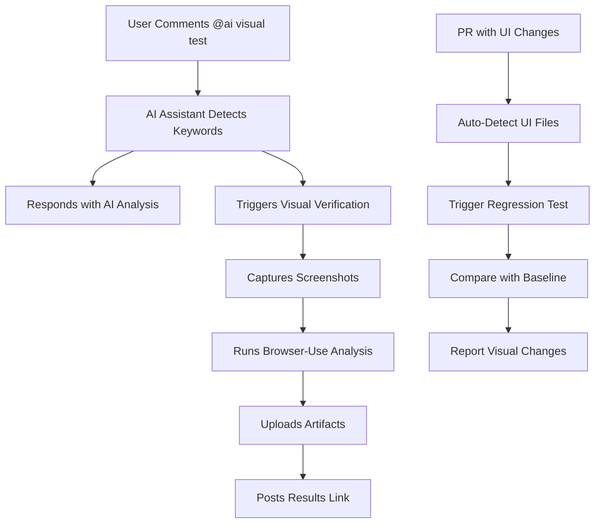

# Hybrid AI Assistant - Complete Development Automation

The `hybrid-ai-assistant.yml` workflow provides **complete autonomous development capabilities** including AI assistance, visual testing, code implementation, and PR management - all integrated into a single powerful workflow.

## 🔗 **How They Work Together**

### **1. Smart Visual Test Triggering**

The AI assistant automatically detects when visual testing is needed and triggers the visual verification workflow.

**Visual Keywords Detected:**
- `visual`, `screenshot`, `responsive`
- `mobile`, `tablet`, `desktop`
- `design`, `layout`, `ui`, `css`
- `test visual`, `check responsive`

### **2. Integration Points**

#### **A. Manual Visual Testing via AI Commands**

```bash
# Trigger responsive testing
@ai test responsive design
@gemini screenshot mobile layout
@copilot check visual consistency

# Comprehensive visual analysis
@ai visual regression test
@gemini analyze ui accessibility
```

**What Happens:**
1. AI assistant processes your request
2. Automatically triggers `visual-verification.yml`
3. Captures screenshots across viewports
4. Runs Browser-Use AI analysis
5. Posts results back to the issue/PR

#### **B. Automatic PR Visual Testing**

When you open a PR with UI changes (CSS, JS, components), the system:

1. **Detects UI files** (`.css`, `.tsx`, `.jsx`, etc.)
2. **Auto-triggers** visual regression testing
3. **Compares** with baseline screenshots
4. **Reports** visual changes in PR comments

#### **C. AI-Guided Visual Analysis**

**For Copilot Commands** (`@copilot visual test`):
- Shows how to use Copilot Chat with Claude 4 Sonnet
- Provides quick Gemini analysis preview
- Triggers comprehensive visual test
- Links to detailed results

**For Gemini Commands** (`@gemini screenshot`):
- Runs immediate automated analysis
- Triggers full visual verification
- Posts AI-generated visual report
- Includes accessibility insights

## 🎯 **Complete Usage Examples**

### **Autonomous Implementation:**

```bash
# AI will create branch, write code, make PR
@gemini implement user authentication system
@ai create a dark mode toggle
@gemini fix the responsive layout bug

# AI analyzes, plans, codes, and submits for review
```

### **Visual Testing:**

```bash
# Trigger visual verification
@ai test the mobile layout
@gemini screenshot responsive design
@copilot analyze visual accessibility
```

### **Code Review & Analysis:**

```bash
# Get detailed code analysis
@gemini review this function for security
@ai explain this algorithm
@copilot suggest performance improvements
```

### **Automatic Triggers:**

- **New Issues** → AI triage, labeling, analysis
- **New PRs** → Automated code review, visual testing
- **Implementation requests** → Branch creation, code generation, PR submission
- **Visual keywords** → Screenshots and UI analysis

## 📊 **Test Configuration**

### **Viewport Sizes:**
- **Desktop**: 1920x1080 (Full HD)
- **Tablet**: 768x1024 (iPad)
- **Mobile**: 375x667 (iPhone)

### **Test Types:**
- **Responsive**: For `@copilot` visual requests
- **Full**: For `@gemini` comprehensive analysis
- **Regression**: For automatic PR testing

### **Target URL:**
- Default: `https://asharitech-web.pages.dev`
- Customizable via workflow parameters

## 🔄 **Workflow Sequence**



## 📁 **Results Location**

**Screenshots & Reports:**
- GitHub Actions → Workflows → Visual Verification
- Artifacts section (screenshots ZIP files)
- Workflow logs (AI analysis results)

**Automated Comments:**
- Posted directly in issues/PRs
- Include links to full results
- Contain AI-generated analysis

## 🛠️ **Configuration Options**

### **Customize Test URL:**
Edit line 152 in `hybrid-ai-assistant.yml`:
```yaml
-f test_url="https://your-custom-domain.com"
```

### **Adjust Viewports:**
Modify viewport sizes in lines 154, 238, 372:
```yaml
-f viewport_sizes="1366x768,414x896,2560x1440"
```

### **Change Visual Keywords:**
Update line 83 to add/remove trigger words:
```bash
VISUAL_KEYWORDS="visual|screenshot|responsive|your-custom-keyword"
```

## 🎨 **AI Models Used**

1. **GitHub Copilot** (Claude 4 Sonnet) - Strategic guidance
2. **Gemini** - Quick automation and analysis
3. **Browser-Use AI** - Visual testing and screenshots
4. **Hybrid Logic** - Smart routing between models

## ✅ **Benefits**

- **Integrated Workflow**: One command triggers multiple AI systems
- **Automatic Testing**: PRs with UI changes get tested automatically
- **Comprehensive Analysis**: Both AI chat guidance + visual verification
- **No Setup Required**: Uses existing Copilot Enterprise access
- **Multi-Model**: Best AI for each task type

## 🚀 **Quick Start**

1. **Test Integration**: Comment `@ai visual test` on any issue
2. **PR Testing**: Open a PR with CSS/JS changes (auto-triggers)
3. **View Results**: Check Actions tab for screenshots and reports
4. **Get AI Help**: Use `@copilot` for detailed visual guidance

The integration is now live and ready to use! 🎉